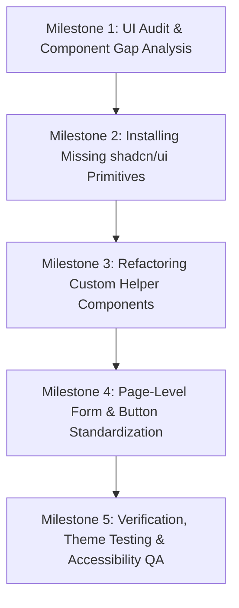

# Control Panel shadcn/ui Standardization Plan

This plan details the steps required to audit, refactor, and standardize the React + Vite **`control-panel`** UI to utilize standard **`shadcn/ui`** components and theme tokens. 

The goal is to eliminate ad-hoc CSS overrides, replace custom wrapper components (like custom pagination and badges) with official shadcn primitives, and ensure full alignment with light/dark theme variables.

---

## 🔍 Current State Analysis
* **Core Tech Stack**: React + Vite + TypeScript + Tailwind CSS v3
* **Current UI**: Shadcn/ui is partially installed. However:
  * Key UI components (e.g., pagination) are currently custom-implemented using raw SVGs and custom Tailwind layout classes.
  * Several styling overrides (like hardcoded `bg-indigo-600 hover:bg-indigo-700` colors) bypass the central CSS variable theme tokens (e.g., `--primary`).
  * Custom helper components like `StatusBadge` and `SearchInput` are not fully unified with the official shadcn components.

---

## 📌 Milestone Breakdown



---

### 📂 Milestone 1: UI Audit & Component Gap Analysis
Locate all custom HTML/CSS elements and hardcoded overrides that bypass shadcn/ui.

#### Tasks:
1. **Audit Files**:
   * Inspect all views under [src/pages/](file:///d:/__Projects/kage/chia.florist/control-panel/src/pages) to list inputs, forms, cards, and buttons with custom styled inline overrides.
2. **Define Component Gaps**:
   * List missing shadcn/ui components (e.g., standard pagination, tooltips, dialogs/drawers, skeletons) that should be added to the project.

---

### 📂 Milestone 2: Installing Missing shadcn/ui Primitives
Add the missing official shadcn components to standardise the UI libraries.

#### Tasks:
1. **Install official components**:
   Run the shadcn CLI in the `control-panel` root to install the missing primitives:
   ```bash
   npx shadcn@latest add pagination badge skeleton tooltip toast
   ```
   This updates the [src/components/ui/](file:///d:/__Projects/kage/chia.florist/control-panel/src/components/ui) directory with standard, accessible Radix-backed items.

---

### 📂 Milestone 3: Refactoring Custom Helper Components
Refactor existing custom components in `src/components/` to compose from the official shadcn/ui components.

#### Tasks:
1. **Refactor [Pagination.tsx](file:///d:/__Projects/kage/chia.florist/control-panel/src/components/Pagination.tsx)**:
   * Replace the custom layout and SVG icons with the newly added `<Pagination>`, `<PaginationContent>`, `<PaginationItem>`, and `<PaginationLink>` components.
2. **Refactor [StatusBadge.tsx](file:///d:/__Projects/kage/chia.florist/control-panel/src/components/StatusBadge.tsx)**:
   * Rather than using inline utility classes (like `bg-emerald-100 text-emerald-800`), map badge states directly to the standard shadcn `<Badge>` component variants (`default`, `secondary`, `destructive`, `outline`) or extend the badge variant configuration in `badge.tsx`.
3. **Refactor [LoadingState.tsx](file:///d:/__Projects/kage/chia.florist/control-panel/src/components/LoadingState.tsx) & [EmptyState.tsx](file:///d:/__Projects/kage/chia.florist/control-panel/src/components/EmptyState.tsx)**:
   * Compose these using shadcn `<Skeleton />` and card primitives for UI consistency.

---

### 📂 Milestone 4: Page-Level Form & Button Standardization
Clean up styling overrides inside pages to match theme tokens.

#### Tasks:
1. **Standardize Hardcoded Buttons**:
   * Find buttons using custom branding (e.g., `<Button className="bg-indigo-600 hover:bg-indigo-700">` in [LoginPage.tsx](file:///d:/__Projects/kage/chia.florist/control-panel/src/pages/auth/LoginPage.tsx) and [AddMerchantAccountPage.tsx](file:///d:/__Projects/kage/chia.florist/control-panel/src/pages/admin/AddMerchantAccountPage.tsx)).
   * Refactor these to use the standard default primary variant (`variant="default"`), allowing them to dynamically adapt when theme modes change.
2. **Form Layout Standardization**:
   * Standardize layout margins, card shapes, and text sizes using shadcn variables.

---

### 📂 Milestone 5: Verification, Theme Testing & Accessibility QA
Verify the visual consistency, themes, and accessibility features.

#### Tasks:
1. **Theme Verification (Light/Dark Modes)**:
   * Verify that all refactored pages render perfectly in both light and dark modes, and color shifts occur automatically without text contrast issues.
2. **Accessibility (Aria & Keyboard) Audit**:
   * Confirm keyboard navigation is operational across the new Pagination system and dialog elements.
3. **Compilation Build**:
   * Execute build checks:
     ```bash
     npm run build
     ```
   * Ensure there are no TypeScript build errors.
