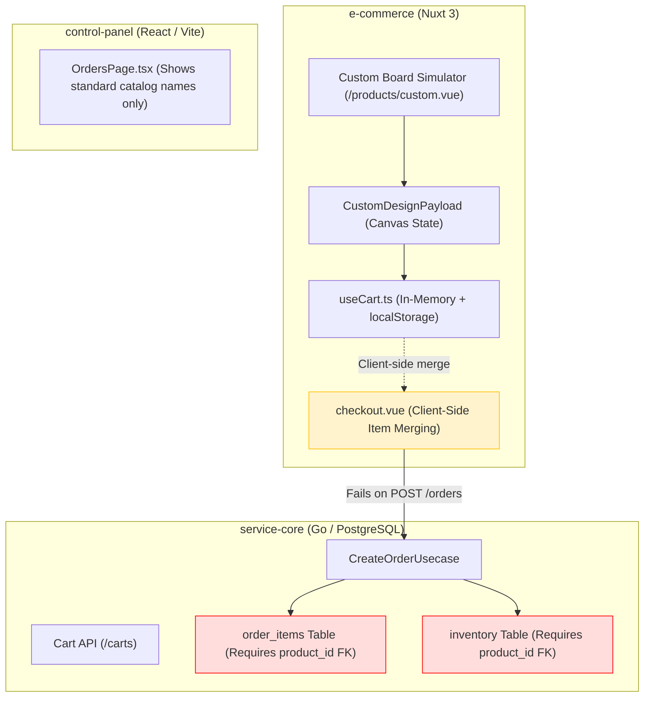
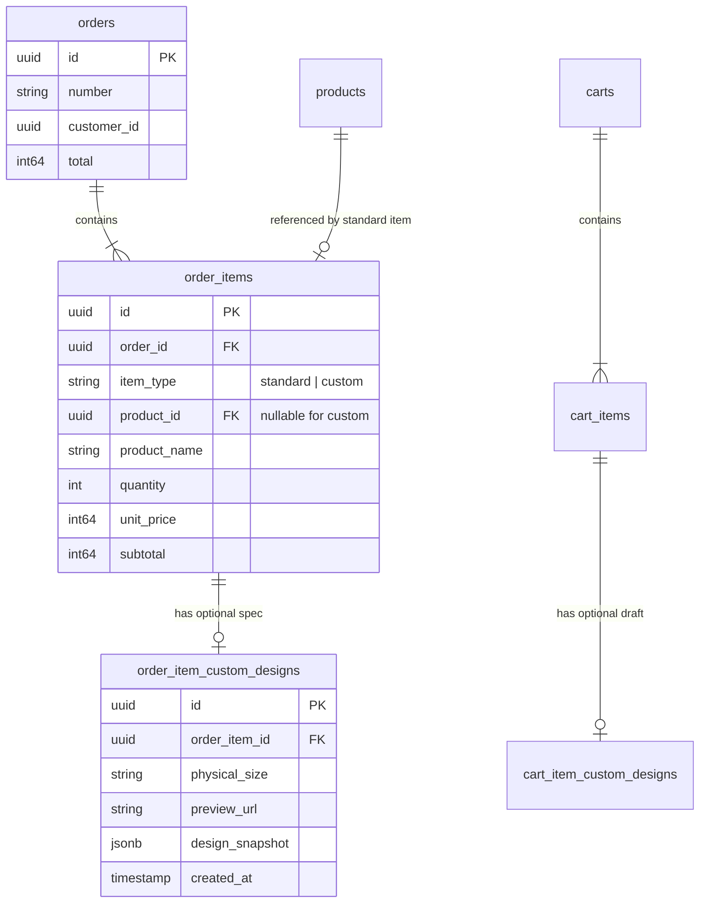
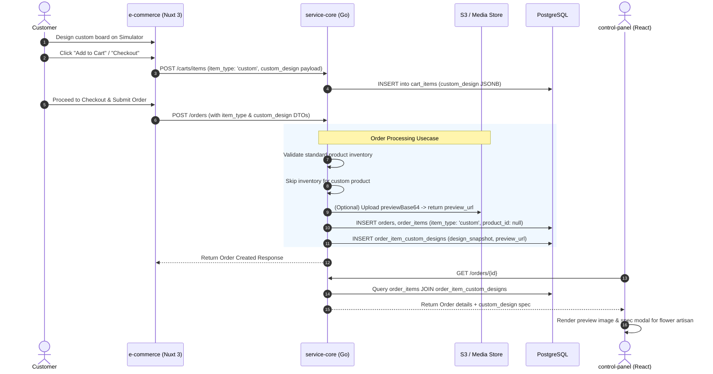

# Technical Analysis & Standardization Report: Custom Product Feature

## Executive Summary

This report analyzes the architecture, data models, and workflow gaps for the **Custom Flower Board Feature** across the **Chia Florist** monorepo ecosystem. 

Currently, the client-side (`e-commerce`) features an interactive canvas simulator (`/products/custom.vue`) that allows users to design custom flower boards. However, the system relies on client-side state workarounds (`localStorage` and memory manipulation) because **the core backend (`service-core`) has no schema or logic to validate, record, or persist custom product orders**.

This document standardizes the domain models, API payloads, database schemas, and data flows between **`e-commerce`**, **`service-core`**, and **`control-panel`**, establishing a unified contract for custom product recording and staff fulfillment.

---

## 1. Current System Audit & Disconnects



### 1.1 Client-Side Analysis (`e-commerce`)
- **Simulator Implementation**: [`e-commerce/app/pages/products/custom.vue`](file:///d:/__Projects/kage/chia.florist/e-commerce/app/pages/products/custom.vue) constructs a rich [`CustomDesignPayload`](file:///d:/__Projects/kage/chia.florist/e-commerce/app/composables/useCart.ts#L9-L44) object capturing:
  - Physical board size & price breakdown (e.g. `1.8x2.5m`, tier IDs).
  - Split section specifications (`upper` and `lower` headers, body texts, fonts, alignments, colors, corner styles).
  - Canvas elements array (dragged flower images, frame choices, brush strokes, coordinates, scaling, rotation).
  - Crest configurations (`topCrest`, `bottomCrest`).
  - Browser-rendered PNG thumbnail (`previewBase64`).
- **Cart & Checkout Workarounds**:
  - In [`useCart.ts`](file:///d:/__Projects/kage/chia.florist/e-commerce/app/composables/useCart.ts#L388-L411), custom items bypass the backend `cartService.addItem` and store design payloads in `localStorage`.
  - In [`checkout.vue`](file:///d:/__Projects/kage/chia.florist/e-commerce/app/pages/checkout.vue#L112-L300), client code filters out custom items from backend cart API requests and manually runs `mergeCustomItems` to patch response data locally.
  - When placing an order (`orderService.createOrder`), custom items send a synthetic product ID (e.g., `"custom-1722526800000"`).

### 1.2 Core Backend Analysis (`service-core`)
- **Database Schema Constraints**:
  - [`order_items`](file:///d:/__Projects/kage/chia.florist/service-core/migrations/0032_create_order_items_table.up.sql#L1-L41) defines `product_id UUID NOT NULL REFERENCES products(id)`. Synthetic strings cause PostgreSQL UUID parsing failures or foreign key violations (`fk_order_items_product_id`).
  - [`cart_items`](file:///d:/__Projects/kage/chia.florist/service-core/migrations/0008_create_cart_items_table.up.sql#L1-L39) also requires `product_id UUID NOT NULL REFERENCES products(id)`, preventing logged-in users from persisting custom items across sessions.
  - No tables exist to store JSON snapshots of custom designs or preview image URLs.
- **Usecase Logic Restrictions**:
  - [`CreateOrderUsecase`](file:///d:/__Projects/kage/chia.florist/service-core/internal/modules/order/usecase/create_order.go#L178-L197) passes every item through `pricingService.Calculate` and attempts `inventoryRepo.Reserve(ProductID)`.
  - Custom products do not exist in catalog inventory, causing stock reservation errors.

### 1.3 Control Panel Analysis (`control-panel`)
- **Admin Visibility**: [`OrdersPage.tsx`](file:///d:/__Projects/kage/chia.florist/control-panel/src/pages/orders/OrdersPage.tsx#L742-L760) renders catalog item names and prices.
- **Fulfillment Blockers**: Merchants have no way to view custom text requirements (e.g. "Happy Wedding John & Jane"), design previews, or dimensions required for artisan florists to produce the physical flower board.

---

## 2. Standardized Architecture Proposal

To cleanly support custom products alongside standard catalog items without breaking existing functionality, we propose standardizing the domain model around an **Item Type Discrimination (`standard` vs `custom`)** architecture.



### Key Architectural Principles
1. **Nullable `product_id` & `item_type` Field**:
   - `order_items.product_id` and `cart_items.product_id` become nullable (`NULL` when `item_type = 'custom'`).
   - Alternatively, a designated system sentinel Product ID (`00000000-0000-0000-0000-000000000001` - "Custom Flower Board") can be referenced. *Nullable `product_id` with `item_type` constraint is recommended for database cleanliness.*
2. **Separation of Custom Specifications**:
   - Custom design snapshot payloads are isolated in dedicated `order_item_custom_designs` and `cart_item_custom_designs` tables (or stored directly as `jsonb` columns).
3. **Decoupled Inventory & Pricing**:
   - Standard products enforce stock reservation in `inventoryRepo.Reserve`.
   - Custom products bypass inventory reservation checks and calculate prices based on physical size and selected features.

---

## 3. Standardized Schemas & API Contracts

### 3.1 Database Schema Migrations (Go / PostgreSQL)

#### Migration: `order_items` & `order_item_custom_designs`
```sql
-- 1. Modify order_items to support custom products
ALTER TABLE order_items 
    ADD COLUMN item_type VARCHAR(32) NOT NULL DEFAULT 'standard',
    ALTER COLUMN product_id DROP NOT NULL;

ALTER TABLE order_items 
    ADD CONSTRAINT check_order_items_product_id 
    CHECK (
        (item_type = 'standard' AND product_id IS NOT NULL) OR 
        (item_type = 'custom')
    );

-- 2. Create order_item_custom_designs table
CREATE TABLE order_item_custom_designs (
    id UUID PRIMARY KEY DEFAULT gen_random_uuid(),
    order_item_id UUID NOT NULL UNIQUE,
    version VARCHAR(16) NOT NULL DEFAULT '1.0',
    physical_size VARCHAR(64) NOT NULL,
    physical_size_id VARCHAR(64) NOT NULL,
    preview_url TEXT,
    header_text_upper VARCHAR(255),
    body_text_upper TEXT,
    header_text_lower VARCHAR(255),
    body_text_lower TEXT,
    design_snapshot JSONB NOT NULL,
    created_at TIMESTAMPTZ NOT NULL DEFAULT NOW(),

    CONSTRAINT fk_custom_design_order_item
        FOREIGN KEY (order_item_id)
        REFERENCES order_items(id)
        ON DELETE CASCADE
);

-- 3. Modify cart_items for custom cart items
ALTER TABLE cart_items 
    ADD COLUMN item_type VARCHAR(32) NOT NULL DEFAULT 'standard',
    ALTER COLUMN product_id DROP NOT NULL,
    ADD COLUMN custom_design JSONB;

-- Remove rigid unique constraint on (cart_id, product_id) when product_id is null
DROP INDEX IF EXISTS unique_product_per_carts;
CREATE UNIQUE INDEX unique_standard_product_per_cart 
ON cart_items(cart_id, product_id) 
WHERE deleted_at IS NULL AND item_type = 'standard';
```

---

### 3.2 Standardized JSON Data Transfer Objects (DTOs)

#### A. Standardized Custom Design Snapshot Schema (`CustomDesignPayload` v1.0.0)
Shared JSON structure sent by `e-commerce` and persisted in `service-core`. Addresses schema versioning, strict type validation, hex color formatting, typography grouping, and Supabase Storage Bucket readiness:

```json
{
  "metadata": {
    "version": "1.0.0",
    "editorVersion": "1.0.0",
    "platform": "web",
    "locale": "id-ID",
    "createdAt": "2026-08-01T23:00:00.000Z",
    "updatedAt": "2026-08-01T23:00:00.000Z",
    "checksum": "a8f3b9e1"
  },
  "layout": {
    "physicalSizeId": "medium",
    "upperHeightRatio": 0.58,
    "border": {
      "style": "solid",
      "colorHex": "#F5C842",
      "widthPx": 12,
      "showCenterDivider": true
    }
  },
  "sections": {
    "upper": {
      "bgColorHex": "#C0392B",
      "cornerStyle": "none",
      "header": {
        "text": "Selamat & Sukses",
        "fontId": "playfair",
        "fontSizePx": 36,
        "fontColorHex": "#FFD700",
        "alignment": "center"
      },
      "body": {
        "text": "Atas Pelantikan Saudara/i\nJane Doe",
        "fontId": "inter",
        "fontSizePx": 20,
        "fontColorHex": "#FFFFFF",
        "alignment": "center"
      }
    },
    "lower": {
      "bgColorHex": "#1A3A5C",
      "cornerStyle": "none",
      "header": {
        "text": null,
        "fontId": "bebas",
        "fontSizePx": 26,
        "fontColorHex": "#FFFFFF",
        "alignment": "center"
      },
      "body": {
        "text": "PT. Tech Nusantara",
        "fontId": "inter",
        "fontSizePx": 22,
        "fontColorHex": "#FFFFFF",
        "alignment": "center"
      }
    }
  },
  "decorations": {
    "topCrest": {
      "visible": true,
      "variantId": "classic",
      "primaryColorHex": "#E63946",
      "secondaryColorHex": "#F1FAEE",
      "scalePercent": 40
    },
    "bottomCrest": {
      "visible": false,
      "variantId": "none",
      "primaryColorHex": "#E63946",
      "secondaryColorHex": "#F1FAEE",
      "scalePercent": 40
    }
  },
  "elements": [
    {
      "id": "elem-1",
      "type": "image",
      "src": "/elements/rose-corner.png",
      "frameStyle": "square",
      "crop": { "xPercent": 50, "yPercent": 50, "zoom": 1 },
      "transform": { "xPercent": 15, "yPercent": 15, "scalePercent": 22, "rotationDeg": 0 }
    },
    {
      "id": "elem-2",
      "type": "brush",
      "brushType": "flower",
      "colorHex": "#E85D75",
      "transform": { "xPercent": 50, "yPercent": 50, "scalePercent": 48, "rotationDeg": 45 }
    }
  ],
  "assets": {
    "previewBase64": "data:image/png;base64,iVBORw0KGgoAAAANSUhEUg...",
    "previewAssetId": "asset_99812401",
    "previewUrl": "https://chia-florist.supabase.co/storage/v1/object/public/custom-previews/designs/2026/08/order-board-a8f3b9e1.png",
    "bucketPath": "custom-previews/designs/2026/08/order-board-a8f3b9e1.png",
    "storageProvider": "supabase"
  }
}
```

#### B. Updated Order Creation Payload (`POST /orders`)
Standardized payload accepted by `CreateOrderUsecase` without client-trusted prices:

```json
{
  "address_id": "3fa85f64-5717-4562-b3fc-2c963f66afa6",
  "payment_method_id": "8b1a877a-2415-4e78-9a3e-79010d7a0123",
  "is_manual": false,
  "shops": [
    {
      "shop_id": "99ef0062-1040-4574-a4be-0123abce5670",
      "courier": {
        "code": "jne",
        "service": "REG"
      },
      "items": [
        {
          "item_type": "standard",
          "product_id": "e7b0c950-6d33-4f51-b851-93c10a421234",
          "quantity": 1
        },
        {
          "item_type": "custom",
          "product_name": "Custom Board — Selamat & Sukses",
          "physical_size_id": "medium",
          "quantity": 1,
          "custom_design": {
            "metadata": {
              "version": "1.0.0",
              "editorVersion": "1.0.0",
              "platform": "web",
              "checksum": "a8f3b9e1"
            },
            "layout": { "physicalSizeId": "medium", "upperHeightRatio": 0.58 },
            "sections": {
              "upper": { "header": { "text": "Selamat & Sukses", "fontId": "playfair" } },
              "lower": { "body": { "text": "PT. Tech Nusantara", "fontId": "inter" } }
            },
            "assets": {
              "previewUrl": "https://chia-florist.supabase.co/storage/v1/object/public/custom-previews/designs/2026/08/order-board-a8f3b9e1.png",
              "bucketPath": "custom-previews/designs/2026/08/order-board-a8f3b9e1.png",
              "storageProvider": "supabase"
            }
          }
        }
      ]
    }
  ]
}
```

---

## 4. End-to-End Workflow Standardization



### Detailed Workflow Components

1. **Cart Persistence Step**:
   - `POST /carts/items` receives `item_type: 'custom'`.
   - `service-core` validates basic pricing parameters (or uses size tier price) and stores the design JSON in `cart_items`.
   - Eliminates client-side `localStorage` caching hacks.

2. **Order Placement & Supabase Storage Preview Asset Handling**:
   - When generating custom board designs in `/products/custom.vue`, the client captures a high-resolution PNG thumbnail (`previewBase64`).
   - During `CreateOrderUsecase.Execute` (or pre-flight media upload `POST /storage/upload`), the image binary is uploaded directly to the **Supabase Storage Bucket (`custom-previews`)**.
   - Supabase populates public CDN handles into `assets`:
     ```json
     "assets": {
       "previewBase64": null,
       "previewAssetId": "asset_99812401",
       "previewUrl": "https://<supabase-ref>.supabase.co/storage/v1/object/public/custom-previews/designs/2026/08/order-board-a8f3b9e1.png",
       "bucketPath": "custom-previews/designs/2026/08/order-board-a8f3b9e1.png",
       "storageProvider": "supabase"
     }
     ```
   - Persisting `previewUrl` directly in `order_item_custom_designs.preview_url` keeps order payloads under 50KB while providing instant CDN image rendering for staffs.

3. **Staff Fulfillment in Control Panel**:
   - Update `OrdersPage.tsx` and order details modal in `control-panel` to detect `item_type === 'custom'`.
   - Display a **"Custom Board Specification"** button/panel.
   - Provide a printable/viewable Spec Sheet containing:
     - High-resolution visual thumbnail preview rendered via Supabase Storage CDN (`previewUrl`).
     - Section-by-section text breakdown (Upper Header, Upper Body, Lower Header, Lower Body).
     - Color hex codes (`#RRGGBB`) & typography details (`fontId`, `fontSizePx`).
     - Element positions & transforms for flower arrangement staff.

---

## 5. Summary Matrix & Comparison

| Domain Component | Legacy Implementation | Standardized Architecture (v1.0.0) |
| :--- | :--- | :--- |
| **Client Storage** | Local memory (`useState`) & `localStorage` keys | Backend-persisted cart via `POST /carts/items` with v1.0.0 schema |
| **Preview Images** | Embedded base64 strings (multi-MB bloat) | Uploaded to **Supabase Storage Bucket (`custom-previews`)** with public `previewUrl` |
| **API Pricing** | Client sends trusted `price` field | Client price removed; `service-core` calculates price based on `physicalSizeId` & items |
| **Schema Validation** | Loose strings (`bgColor`, `heightRatio`) | Strict hex codes (`#RRGGBB`), `upperHeightRatio`, nested `TypographySpec` (`header`/`body`) |
| **Deduplication** | No checksum / hashing | SHA-256 / FNV-1a checksum hash stored in `metadata.checksum` |
| **Database Schema** | `order_items.product_id` required FK constraint | `order_items.product_id` nullable + `order_item_custom_designs` table |
| **Stock Management** | Fails attempting stock lookup on synthetic product IDs | Standard items check inventory; custom items bypass stock checks |
| **Staff Visibility** | Admin sees generic name, missing layout/text specs | Full design snapshot, Supabase CDN preview thumbnail, and text breakdown in `control-panel` |

---

> [!NOTE]
> **Implementation Status**: Client-side Nuxt 3 application (`e-commerce`) has been fully updated to support the standardized v1.0.0 schema, Supabase bucket storage asset structure, checksum hashing, and automatic migration for legacy v1.0 payloads.
