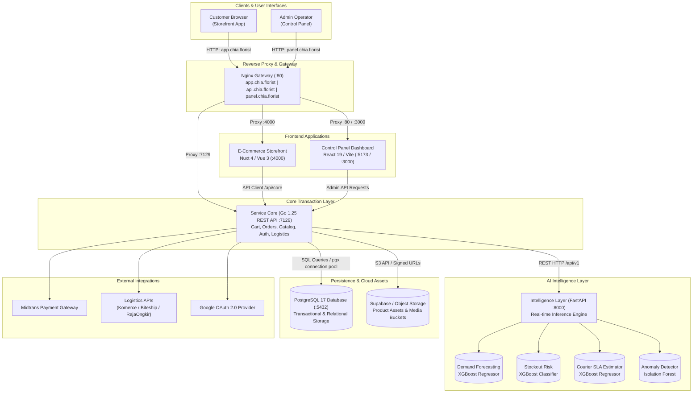

# Page 1: Cover & Preface

```text
           .     .                          
      ..   8"=,,88,   _.                    
       8""=""8'  "88a88'                    
  .. .;88m a8   ,8"" "8       ▄▄▄▄ ▄▄ ▄▄ ▄▄  ▄▄▄ 
   "8"'  "88"  A"     8;     ██▀▀▀ ██▄██ ██ ██▀██
    "8   8,  8,       "8     ▀████ ██ ██ ██ ██▀██
     8,  "8, "8,    ___8,      ▄▄▄▄▄ ▄▄     ▄▄▄  ▄▄▄▄  ▄▄  ▄▄▄▄ ▄▄▄▄▄▄              
     "8,  "8, "8mm""""""8m.    ██▄▄  ██    ██▀██ ██▄█▄ ██ ███▄▄   ██   
      "8,am888i"'   ,mm"     ▄ ██    ██▄▄▄ ▀███▀ ██ ██ ██ ▄▄██▀   ██   
      ,8"  _8"  .m888"                                   
     ,88P"""""I888888        CHIA FLORIST PLATFORM
     "'         "I888        Installation & Operations Booklet
                  "I8_       Production-Grade Modular Architecture
      ,mmeem.m""i, I8""  ,mmeem,'.     
     m""    . "8.8 I8  ,8"   .  "88     
    i8  . '  ,mi""8I8 ,8 . '  ,8" 88     
    88.' ,mm""    "8I88"m,,mm'"    8     
    "8_m""         "I8   ""'            (c) AETHERGEAR
     "8             I8_             
```

## Preface

Welcome to the **Chia Florist Platform Installation & Operations Booklet**.

Chia Florist is an enterprise-grade, modular e-commerce ecosystem designed to simulate real-world production architecture. The platform unifies modern customer-facing storefronts, administrative back-offices, security monitoring proxies, transactional Go backend microservices, and a specialized Python-based **AI Intelligence Layer** for real-time predictive analytics and anomaly detection.

### Engineering Principles
1. **Separation of Concerns**: Each tier—Storefront, Admin UI, Backend API, and AI Lab—operates as an independent, loosely coupled service with distinct lifecycle management.
2. **Predictive Intelligence**: Machine learning inference models (Demand Forecasting, Stockout Risk, Courier SLA, and Anomaly Detection) run in real time alongside transactional pipelines.
3. **Reproducibility**: Standardized local setups via unified Docker Compose orchestration, automated schema migrations, and comprehensive environment templates.

This booklet provides an exhaustive, end-to-end technical manual for deploying, configuring, and operating the entire Chia Florist ecosystem.

# Page 2: System Architecture & Topology

The Chia Florist platform employs a modern microservices architecture with a unified gateway layer routing traffic across specialized services.

## High-Level System Architecture



## Architectural Tier Breakdown

1. **Gateway Layer (*nginx*)**: Acts as a reverse-proxy gateway dispatching subdomains (*app.chia.florist*, *api.chia.florist*, *panel.chia.florist*) to internal microservices and terminating client traffic.
2. **Customer Storefront (*e-commerce*)**: Nuxt 4 (Vue 3, Tailwind CSS) server-side rendered application optimized for SEO and rapid client-side interactions.
3. **Admin Dashboard (*control-panel*)**: React 19 single-page application (SPA) with Vite tooling, managing catalog operations, order logistics, inventory monitoring, and security logs.
4. **Backend Core (*service-core*)**: High-performance Go REST API built with Chi router, handling database transactions, JWT authentication, inventory lifecycle, and external webhook integrations.
5. **AI Intelligence Layer (*intelligence-layer*)**: Python FastAPI server executing low-latency Machine Learning inference (XGBoost, Scikit-Learn Isolation Forest) for demand forecasting, stockout prevention, delivery SLA prediction, and payment anomaly detection.
6. **Persistence Layer (*postgres* / *supabase*)**: PostgreSQL 17 database storing all relational models, orders, inventory logs, audit trails, and product catalogs.

# Page 3: Project Structure & Repository Layout

The Chia Florist codebase is organized as a modular repository with dedicated directories for each service domain.

```text
chia.florist/
│
├── control-panel/              # Administrator Dashboard & Security Proxy
│   ├── src/                    # React 19 UI components, pages & hooks
│   ├── main.go                 # Standalone Go WAF proxy server
│   ├── waf-rules.json          # Security filtering & WAF rules
│   ├── Dockerfile              # Multi-stage build (Node 22 -> Nginx 1.27)
│   └── package.json            # Vite, React, Radix UI, Tailwind CSS
│
├── docs/                       # Architecture diagrams, API specs & guides
│   ├── INSTALLATION_GUIDE.md   # Standard installation guide
│   ├── INSTALLATION_BOOKLET.md # This comprehensive booklet
│   ├── api/                    # API specifications (AI Lab, Customer, Merchant)
│   └── data-flow-diagram/      # DFD Level 1-3 workflows
│
├── e-commerce/                 # Customer-Facing Storefront Application
│   ├── app/                    # Nuxt 4 application routes & pages
│   ├── components/             # Reusable Vue 3 UI components
│   ├── features/               # Domain-driven feature modules (cart, catalog)
│   ├── nuxt.config.ts          # SSR route rules, runtime configs & Tailwind
│   └── package.json            # Nuxt 4, Vue 3, Tailwind CSS v4
│
├── intelligence-layer/         # AI & Machine Learning Prediction Service
│   ├── app/                    # FastAPI web server application
│   │   ├── api/v1/             # Inference routers (demand, stockout, courier, anomaly)
│   │   ├── services/           # Model loading registry & prediction engines
│   │   └── schemas/            # Pydantic v2 validation contracts
│   ├── configs/                # ML hyperparameters & experiment configs
│   ├── models/                 # Pretrained model weights (.json, .pkl)
│   ├── src/                    # Feature loaders, trainers & preprocessing
│   ├── tests/                  # Pytest unit & integration test suites
│   ├── train.py                # Command-line training pipeline
│   ├── train_*.py              # Domain-specific model training scripts
│   ├── Dockerfile              # Python 3.11-slim runtime container
│   └── requirements.txt        # FastAPI, XGBoost, Scikit-Learn, PyTorch
│
├── service-core/               # Core Backend REST API
│   ├── cmd/                    # Entrypoints: server, migrate, seed
│   ├── internal/               # Domain logic, usecases, repositories & delivery
│   ├── migrations/             # SQL schema migrations (0001 to 0200)
│   ├── seeds/                  # Initial seeders (courier, location, roles)
│   ├── go.mod                  # Go 1.25 module dependencies
│   └── Dockerfile              # Multi-stage Go alpine build
│
├── nginx/                      # Local gateway reverse-proxy configurations
│   └── nginx.conf              # Subdomain reverse-proxy rules
│
├── docker-compose.yml          # Full development stack orchestration
├── docker-compose.monolith.yml # Single-container monolith configuration
└── README.md                   # Platform overview & contributor guidelines
```

# Page 4: Table of Contents

| Page | Title | Description |
| :---: | :--- | :--- |
| **1** | [Cover & Preface](#page-1-cover--preface) | Document overview, platform vision, and engineering principles |
| **2** | [System Architecture & Topology](#page-2-system-architecture--topology) | Microservices architecture, Mermaid topology diagram, tier breakdown |
| **3** | [Project Structure & Repository Layout](#page-3-project-structure--repository-layout) | Complete codebase tree and module responsibilities |
| **4** | [Table of Contents](#page-4-table-of-contents) | Page index and booklet navigation |
| **5** | [Service & Port Matrix](#page-5-service--port-matrix) | Comprehensive networking, ports, subdomains, and health endpoints |
| **6** | [Docker Compose Stack Orchestration](#page-6-docker-compose-stack-orchestration) | Rapid deployment of the full multi-container stack |
| **7** | [Intelligence Layer (AI Module) Setup](#page-7-intelligence-layer-ai-module-setup) | Python 3.11 environment, virtual environment, and FastAPI server |
| **8** | [AI Lab: Model Training & Endpoints](#page-8-ai-lab-model-training--endpoints) | ML inference endpoints, training pipeline, and pytest validation |
| **9** | [Service Core Backend (Go API) Setup](#page-9-service-core-backend-go-api-setup) | Go 1.25 backend setup, environment configuration, and server launch |
| **10** | [Database Migrations & Seeding](#page-10-database-migrations--seeding) | PostgreSQL schema initialization, migration tools, and seed data |
| **11** | [E-Commerce Storefront (Nuxt 4) Setup](#page-11-e-commerce-storefront-nuxt-4-setup) | Nuxt 4 SSR storefront setup, configuration, and build commands |
| **12** | [Control Panel & WAF Proxy Setup](#page-12-control-panel--waf-proxy-setup) | Admin dashboard UI and optional Go WAF proxy configuration |
| **13** | [System Verification & Operations Runbook](#page-13-system-verification--operations-runbook) | Inter-service verification checklist, logging, and troubleshooting |

# Page 5: Service & Port Matrix

Below is the definitive port, protocol, and endpoint mapping for all services in local and Docker Compose environments.

## Network Endpoint Reference

| Service Name | Primary Stack | Local Port | Docker Compose Subdomain | Health Check / Documentation |
| :--- | :--- | :--- | :--- | :--- |
| **E-Commerce Storefront** | Nuxt 4 / Vue 3 | *4000* | *http://app.chia.florist* | *GET http://localhost:4000* |
| **Service Core API** | Go 1.25+ / Chi | *7129* | *http://api.chia.florist* | *GET http://localhost:7129/health* |
| **Intelligence Layer (AI)** | FastAPI / Python 3.11 | *8000* | *http://localhost:8000* | *GET http://localhost:8000/api/v1/health*<br>*GET http://localhost:8000/docs* |
| **Control Panel Dashboard** | React 19 / Vite | *5173* (dev)<br>*3000* (docker) | *http://panel.chia.florist* | *GET http://localhost:5173* |
| **WAF Proxy (Optional)** | Go 1.25+ | *8080* | — | *GET http://localhost:8080* |
| **PostgreSQL Database** | PostgreSQL 17 | *5432* | — | *pg_isready -h localhost -p 5432* |
| **Nginx Reverse Gateway** | Nginx 1.27 Alpine | *80* | **.chia.florist* | *GET http://127.0.0.1:80* |

## Subdomain Host Resolution

For local subdomain routing to operate correctly via the Nginx reverse-proxy, configure your operating system hosts file:

- **Windows Path**: *C:\Windows\System32\drivers\etc\hosts*
- **Linux / macOS Path**: */etc/hosts*

Add the following entry:
```text
127.0.0.1  app.chia.florist api.chia.florist panel.chia.florist chia.florist
```

# Page 6: Docker Compose Stack Orchestration

Docker Compose provides a single-command deployment to launch all microservices, databases, and reverse-proxy gateways in isolated Linux containers.

## 1. Prerequisites

- [Docker Desktop](https://www.docker.com/products/docker-desktop/) (v24.0+) or Docker Engine with the *compose* plugin.
- Operating system hosts file mapped to *app.chia.florist*, *api.chia.florist*, and *panel.chia.florist*.

## 2. Environment Preparation

Before starting Docker Compose, copy and configure the environment template files for the individual services:

```bash
# Service Core backend environment
cp service-core/.env.example service-core/.env

# E-Commerce storefront environment
cp e-commerce/.env.example e-commerce/.env

# Control Panel dashboard environment
cp control-panel/.env.example control-panel/.env
```

> [!TIP]
> In Docker Compose, the services communicate over the internal bridge network:
> - *service-core* automatically connects to PostgreSQL at *postgres:5432* and the AI Layer at *http://intelligence-layer:8000/api/v1*.
> - *e-commerce* reaches *service-core* at *http://service-core:7129*.
> - *nginx* forwards external HTTP traffic on port 80 based on the incoming *Host* header.

## 3. Orchestration Commands

### Build and Start All Containers
```bash
docker compose up --build
```

### Start in Detached Background Mode
```bash
docker compose up --build -d
```

### Check Container Status
```bash
docker compose ps
```

### Inspect Aggregated Logs
```bash
# Follow logs from all services
docker compose logs -f

# Follow logs from AI Layer and Backend Core only
docker compose logs -f intelligence-layer service-core
```

### Stop and Tear Down the Stack
```bash
# Stop containers
docker compose down

# Stop containers and remove persistent database volumes
docker compose down -v
```

# Page 7: Intelligence Layer (AI Module) Setup

The *intelligence-layer* is a dedicated FastAPI Python microservice delivering low-latency Machine Learning predictions, real-time risk scoring, and security anomaly detection.

## 1. Prerequisites

- **Python 3.10+** (Python 3.11 recommended).
- Python package installer (*pip*) and *venv* module.

## 2. Installation & Virtual Environment

Navigate to the *intelligence-layer* directory and set up an isolated virtual environment:

### Windows (PowerShell)
```powershell
cd intelligence-layer
python -m venv .venv
.venv\Scripts\Activate.ps1
pip install --upgrade pip
pip install -r requirements.txt
```

### Linux / macOS (Bash / Zsh)
```bash
cd intelligence-layer
python3 -m venv .venv
source .venv/bin/activate
pip install --upgrade pip
pip install -r requirements.txt
```

## 3. Configuration

The AI service uses standard environment variables with default fallbacks defined in *app/config.py*:

| Variable | Default Value | Description |
| :--- | :--- | :--- |
| *HOST* | *0.0.0.0* | Host IP address to bind server |
| *PORT* | *8000* | Port number to listen on |
| *MODELS_DIR* | *models* | Path to directory containing model weights |
| *CONFIGS_DIR* | *configs* | Path to training hyperparameter YAML files |
| *LOG_LEVEL* | *INFO* | Logging level (*DEBUG*, *INFO*, *WARNING*, *ERROR*) |
| *ALLOWED_ORIGINS* | *["*"]* | Allowed CORS origins list |

## 4. Running the Development Server

Launch the Uvicorn ASGI server with automatic code reloading:

```bash
uvicorn app.main:app --host 0.0.0.0 --port 8000 --reload
```

## 5. Verification & Documentation

Once started, test the service using your browser or command-line tools:

- **Swagger UI Interactive API Docs**: [http://localhost:8000/docs](http://localhost:8000/docs)
- **ReDoc API Reference**: [http://localhost:8000/redoc](http://localhost:8000/redoc)
- **Health Check Endpoint**:
  ```bash
  curl -s http://localhost:8000/api/v1/health | jq .
  ```

# Page 8: AI Lab: Model Training & Endpoints

The Intelligence Layer houses both real-time inference endpoints and an offline AI Lab for training, evaluation, and test verification.

## 1. Real-Time Inference Endpoints

All inference routes return a standardized JSON response envelope: *{"success": true, "data": { ... }, "error": null}*.

### 1.1 Demand Forecasting
- **Endpoint**: *POST /api/v1/predict/demand*
- **Model**: XGBoost Regressor
- **Function**: Projects 7-day SKU unit demand based on historical lags, sales velocity, and product metrics.

### 1.2 Stockout Risk Scoring
- **Endpoint**: *POST /api/v1/predict/stockout-risk*
- **Model**: XGBoost Classifier
- **Function**: Evaluates stockout probability (0.0 to 1.0) within supplier lead time and triggers safety reorder alerts (*CRITICAL*, *WARNING*, *HEALTHY*).

### 1.3 Courier SLA & Transit Duration
- **Endpoint**: *POST /api/v1/predict/courier-sla*
- **Model**: XGBoost Regressor
- **Function**: Estimates transit duration in hours and computes SLA reliability confidence scores for partner couriers (*jne*, *jnt*, *sicepat*).

### 1.4 Operational Anomaly Detection
- **Endpoint**: *POST /api/v1/predict/anomaly*
- **Model**: Scikit-Learn Isolation Forest
- **Function**: Unsupervised anomaly detection detecting excessive payment latency, order-to-fulfillment delays, and high-value payment discrepancies.

## 2. Model Training Pipeline

You can retrain all models using the AI Lab training scripts located in *intelligence-layer/*:

```bash
# Execute end-to-end training pipeline with default configuration
python train.py --config configs/default_config.yaml

# Train individual model components
python train_demand.py       # Outputs models/demand_forecasting.json
python train_stockout.py     # Outputs models/stockout_risk.json
python train_courier_sla.py  # Outputs models/courier_sla.json
python train_anomaly.py      # Outputs models/anomaly_detector/isolation_forest.pkl
```

## 3. Running Test Suites

Run the Pytest suite to validate data loading, feature transformation, and inference integrity:

```bash
pytest -v
```

# Page 9: Service Core Backend (Go API) Setup

The *service-core* is the backbone of the Chia Florist platform, implemented in Go 1.25 using clean architecture and domain-driven design principles.

## 1. Prerequisites

- **Go** (version 1.25.7 or higher recommended).
- **PostgreSQL** database server (local PostgreSQL 17 or remote Supabase instance).

## 2. Environment Configuration

Copy the sample environment file and configure the database and service secrets:

```bash
cp service-core/.env.example service-core/.env
```

### Essential Environment Variables in *service-core/.env*:

```ini
# --- Bootstrap & Server ---
MY_APP_SAYA_HOST=127.0.0.1
MY_APP_SAYA_PORT=7129
APP_ENV=development
APP_CORS_ALLOWED_ORIGINS=http://127.0.0.1:4000,http://127.0.0.1:3000,http://app.chia.florist,http://panel.chia.florist

# --- Security ---
JWT_SECRET=your_super_secret_jwt_key_min_32_chars

# --- Intelligence Layer (AI Server Integration) ---
INTELLIGENCE_LAYER_BASE_URL=http://localhost:8000/api/v1
INTELLIGENCE_LAYER_TIMEOUT_MS=500
INTELLIGENCE_LAYER_ENABLED=true

# --- Database Connection (PostgreSQL) ---
POSTGRES_DB_HOST=127.0.0.1
POSTGRES_DB_PORT=5432
POSTGRES_DB_NAME=chia_florase
POSTGRES_DB_USER=chiaw
POSTGRES_DB_PASSWORD=your_secure_password
POSTGRES_DB_SSLMODE=disable

# --- Supabase Storage & Object Provider ---
SUPABASE_PROJECT_URL=https://your-project.supabase.co
SUPABASE_SUPA_KEY=your_supabase_service_role_key

# --- Third-Party Logistics & Payment Providers ---
MIDTRANS_SERVER_KEY=your_midtrans_server_key
RAJAONGKIR_URL=https://api.rajaongkir.com/starter
KOMERCE_API_KEY=your_komerce_key
BITESHIP_API_KEY=your_biteship_key
```

## 3. Dependency Management

Navigate to *service-core* and verify Go module dependencies:

```bash
cd service-core
go mod tidy
```

## 4. Running the API Server

Start the Go REST API server:

```bash
go run cmd/server/main.go
```

Verify the API is active by checking the health endpoint:
```bash
curl http://127.0.0.1:7129/health
```

# Page 10: Database Migrations & Seeding

The platform utilizes a structured migration and seed system in *service-core* to manage relational tables, constraints, roles, locations, and default policies.

## 1. Migration System Overview

Migration scripts are located under *service-core/migrations/* (numbered sequentially from *0001* through *0200*). They establish:
- Core tables: Users, Accounts, Roles, Permissions, Staff
- E-Commerce entities: Products, Product Images, Inventory, Carts, Orders, Invoices
- Logistics: Customer Addresses, Shop Addresses, Couriers, Shipments
- Security & Analytics: Audit Logs, WAF Rules, IP Access Lists, Product Stock History

## 2. Executing Migrations

To apply all pending database migrations against the configured PostgreSQL database:

```bash
cd service-core
go run cmd/migrate/main.go
```

Expected output:
```text
migration start
[INFO] Executing migrations...
[INFO] Applied migration: 0001_create_users_table.up.sql
...
[INFO] Applied migration: 0200_add_order_handling_expiration_and_refund_status.up.sql
migration complete
```

## 3. Populating Seed Data

To populate initial operational reference data (courier options, Indonesian geographic provinces/cities/districts, default RBAC roles, and baseline WAF rules):

```bash
cd service-core
go run cmd/seed/main.go
```

Expected output:
```text
seed start
[INFO] Seeding roles and permissions...
[INFO] Seeding location data (provinces, cities, districts)...
[INFO] Seeding couriers (JNE, J&T, SiCepat)...
[INFO] Seeding default WAF rules...
seed complete
```

# Page 11: E-Commerce Storefront (Nuxt 4) Setup

The *e-commerce* service provides the customer-facing digital storefront built with Nuxt 4 (Vue 3, Tailwind CSS v4).

## 1. Prerequisites

- **Node.js** (version 18.x, 20.x, or 22.x LTS).
- Package manager: *npm*, *pnpm*, *yarn*, or *bun*.

## 2. Environment Configuration

Copy the template environment file:

```bash
cp e-commerce/.env.example e-commerce/.env
```

Configure parameters in *e-commerce/.env*:

```ini
# --- Server Bind Settings ---
HOST=0.0.0.0
PORT=4000

# --- Service Core Backend Endpoint ---
NUXT_PUBLIC_SERVICE_CORE_API_URL=http://127.0.0.1:7129

# --- Supabase Public Client (Public Anonymous Key Only) ---
SUPABASE_CHIA_URL=https://your-project.supabase.co
SUPABASE_CHIA_KEY=your-supabase-public-anon-key
```

> [!CAUTION]
> Never place backend service role keys or sensitive secrets into *e-commerce/.env*. Only use public anonymous keys.

## 3. Dependency Installation

Navigate to *e-commerce* and install Node dependencies:

```bash
cd e-commerce

# Using npm
npm install

# Or using pnpm
pnpm install
```

## 4. Running the Development Server

```bash
npm run dev
```

The storefront will be available at [http://localhost:4000](http://localhost:4000) (or [http://app.chia.florist](http://app.chia.florist) when using Docker/hosts).

## 5. Production Build & SSR Preview

```bash
# Compile and build the production bundle
npm run build

# Preview the production SSR server
npm run preview
```

# Page 12: Control Panel & WAF Proxy Setup

The *control-panel* directory contains the administrative management dashboard UI (React 19, TypeScript, Vite) and an optional custom Go Web Application Firewall (WAF) proxy.

## 1. Prerequisites

- **Node.js** (version 18+ or 20+ LTS).
- **Go** (version 1.25+) if compiling or running the standalone WAF proxy server.

## 2. Environment Configuration

Copy the template environment file:

```bash
cp control-panel/.env.example control-panel/.env
```

Configure parameters in *control-panel/.env*:

```ini
# --- API Base URL ---
SERVICE_CORE_API_URL=http://127.0.0.1:7129/api/core

# --- Supabase Storage ---
SUPABASE_URL=https://your-project.supabase.co
SUPABASE_KEY=your-public-anon-key
```

## 3. Frontend Dashboard Installation & Run

```bash
cd control-panel

# Install dependencies
npm install

# Start Vite development server
npm run dev
```

The admin dashboard will be accessible at [http://localhost:5173](http://localhost:5173).

To build the production assets:
```bash
npm run build
```


# Page 13: System Verification & Operations Runbook

This page provides an operational checklist for verifying inter-service health, diagnosing connectivity issues, and performing routine maintenance.

## 1. End-to-End Health Verification Checklist

| Check | Target | Verification Command / URL | Expected Result |
| :---: | :--- | :--- | :--- |
| **1** | PostgreSQL DB | *pg_isready -h localhost -p 5432* | *accepting connections* |
| **2** | AI Intelligence Layer | *curl http://localhost:8000/api/v1/health* | *status: healthy*, models loaded |
| **3** | AI Swagger Docs | *http://localhost:8000/docs* | Swagger UI rendered in browser |
| **4** | Service Core API | *curl http://localhost:7129/health* | *HTTP 200 OK* |
| **5** | Storefront UI | *http://localhost:4000* | Homepage renders with catalog |
| **6** | Admin Dashboard | *http://localhost:5173* | Admin login page renders |
| **7** | Nginx Gateway | *curl http://app.chia.florist* | Storefront HTTP response |

## 2. Verifying AI Inference from Service Core

To test that *service-core* successfully communicates with *intelligence-layer*, execute a test inference request:

```bash
# Direct test against Intelligence Layer
curl -X POST http://localhost:8000/api/v1/predict/stockout-risk \
  -H "Content-Type: application/json" \
  -d '{
    "product_id": "SKU-TEST-001",
    "stock": 4.0,
    "reserved_stock": 1.0,
    "stock_burn_rate_7d": 2.5,
    "supplier_lead_time_days": 5.0
  }'
```

Expected response:
```json
{
  "success": true,
  "data": {
    "product_id": "SKU-TEST-001",
    "stockout_probability": 0.892,
    "will_stockout": true,
    "risk_level": "CRITICAL"
  },
  "error": null,
  "meta": null
}
```

## 3. Common Troubleshooting Scenarios

### Scenario A: *service-core* Cannot Connect to *intelligence-layer*
- **Symptom**: *service-core* logs show *intelligence-layer HTTP request failed: connection refused*.
- **Resolution**:
  - In local development: Ensure *intelligence-layer* is running and *INTELLIGENCE_LAYER_BASE_URL=http://localhost:8000/api/v1*.
  - In Docker Compose: Ensure *INTELLIGENCE_LAYER_BASE_URL=http://intelligence-layer:8000/api/v1* and the container is marked healthy.

### Scenario B: AI Models Report "Missing" Status
- **Symptom**: */api/v1/health* returns *"model_details": {"stockout": "missing"}*.
- **Resolution**: Run the corresponding training script in *intelligence-layer/* (e.g., *python train_stockout.py*) to generate the model checkpoint in *models/*.

### Scenario C: Nginx Gateway Returns *502 Bad Gateway*
- **Symptom**: Browsing *http://app.chia.florist* yields 502.
- **Resolution**: Ensure the underlying container (*chia-e-commerce* or *chia-service-core*) is running and its healthcheck is passing. Inspect logs via *docker compose logs nginx*.